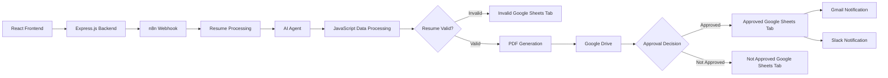

# 🤖 AI Resume Screening & Recruitment Automation System

> An AI-powered recruitment automation system that processes candidate applications, evaluates resumes, validates candidate data, tracks approval decisions, stores documents, and automates company notifications and daily reporting.

Built with **React, Express.js, n8n, AI Agents, JavaScript, Google Sheets, Google Drive, Gmail, and Slack.**

---

## ✨ Overview

This project automates the recruitment screening process from candidate application submission to AI-based evaluation, validation, approval tracking, document storage, and company notifications.

The system is divided into two independent automation workflows:

- 🔄 **Workflow 1:** Candidate Screening & Recruitment Automation
- 📊 **Workflow 2:** Daily Approved Candidate Summary

---

## 🏗️ System Architecture



---

# 🔄 Workflow 1: Candidate Screening & Recruitment Automation

Workflow 1 processes a candidate application from initial submission through resume evaluation, validation, document storage, approval processing, and company notifications.

<div align="center">


</div>

## 📥 Application Flow

```text
Candidate
    ↓
React Frontend
    ↓
Express.js Backend
    ↓
n8n Webhook
```

## 🧠 Resume Processing & AI Evaluation

The submitted resume is processed inside the n8n workflow and prepared for AI-based evaluation.

The AI Agent evaluates candidate information and resume data based on configured screening criteria, including:

- Qualification
- Subject Knowledge
- Relevant Experience
- Teaching or Training Experience
- Communication
- Resume Quality
- Form & Resume Consistency
- Skills
- Candidate Score
- Final Decision
- Reason for Decision

## ⚙️ JavaScript Data Processing

The AI Agent response is processed using JavaScript to:

- Structure candidate information
- Normalize AI-generated output
- Prepare consistent candidate data
- Process screening results
- Determine the next workflow path

---

# ✅ Resume Validation

The workflow checks whether the submitted resume is valid before continuing the recruitment process.

### ❌ Invalid Resume

```text
Invalid Resume
      ↓
Invalid Google Sheets Tab
      ↓
Workflow Stops
```

If the resume is invalid:

- Candidate data is stored in the **Invalid Google Sheets** tab.
- The workflow stops for that candidate.

### ✅ Valid Resume

```text
Valid Resume
      ↓
PDF Generation
      ↓
Google Drive
      ↓
Resume Drive Link
      ↓
Approval Decision
```

For valid resumes:

1. A PDF document is generated.
2. The generated document is stored in Google Drive.
3. The Google Drive link is stored with the candidate record.
4. The candidate continues to the approval decision stage.

---

# 🎯 Approval Processing

## ✅ Approved Candidate

```text
Approved Candidate
        ↓
Approved Google Sheets Tab
        ↓
Google Drive Resume Link
        ↓
Gmail Notification
        ↓
Slack Notification
```

For approved candidates:

- Candidate information is stored in the **Approved Google Sheets** tab.
- The Google Drive resume link is stored with the candidate record.
- Candidate information is sent to the client/company by email.
- The company receives a Slack notification.

## ❌ Not Approved Candidate

```text
Not Approved Candidate
        ↓
Not Approved Google Sheets Tab
        ↓
Google Drive Resume Link
```

For candidates who are not approved:

- Candidate information is stored in the **Not Approved Google Sheets** tab.
- The Google Drive resume link is stored with the candidate record.

---

# 📊 Workflow 2: Daily Approved Candidate Summary

Workflow 2 runs independently from the main candidate screening workflow.

It processes approved candidates from the previous day and sends a summary to the company by email.

<div align="center">


</div>

```text
Scheduled Workflow
        ↓
Time Check
        ↓
Previous Day's Approved Candidates
        ↓
Summary Generation
        ↓
Company Email
```

The workflow:

- Runs on a scheduled basis.
- Checks whether the configured reporting time has been reached.
- Retrieves approved candidates from the previous day.
- Generates a summary.
- Sends the summary to the company by email.

---

# 🖥️ React Frontend

The React frontend provides the candidate-facing application interface.

Candidates can:

- View the recruitment application page.
- Enter application details.
- Upload their resume.
- Submit their application.

## 📸 Application Interface

<div align="center">


<br>

<h3>⬇️</h3>

<br>


<br>

<h3>⬇️</h3>

<br>


</div>

---

# 🧰 Technology Stack

| Layer | Technologies |
|---|---|
| **Frontend** | React.js, JavaScript, HTML, CSS |
| **Backend** | Node.js, Express.js, REST APIs |
| **Automation** | n8n, Webhooks, JavaScript Code Nodes |
| **AI** | AI Agents, Gemini AI, LLM Integration |
| **Data & Storage** | Google Sheets, Google Drive |
| **Communication** | Gmail, Slack |
| **Tools** | Postman, Git, GitHub, PDF Automation |

---

# 🚀 Key Features

- ✅ React-based candidate application interface
- 📄 Resume upload and application data collection
- 🔌 Express.js backend integration
- 🌐 n8n webhook integration
- ⚙️ Automated resume processing
- 🤖 AI-based resume evaluation
- 🧠 JavaScript-based AI output processing
- 🔍 Resume validation and routing
- ❌ Invalid resume handling
- 📑 Automated PDF generation
- ☁️ Google Drive document storage
- 📊 Google Sheets candidate tracking
- ✅ Approved candidate tracking
- ❌ Not Approved candidate tracking
- 🔗 Resume Drive link storage
- 📧 Automated Gmail notifications
- 💬 Slack notifications
- 📅 Daily approved-candidate summary emails

---

# 🎯 Project Objective

The objective of this project is to automate repetitive recruitment workflow tasks using AI and workflow automation.

The system connects:

```text
Candidate Application
        ↓
AI Resume Evaluation
        ↓
Resume Validation
        ↓
Document Storage
        ↓
Candidate Tracking
        ↓
Approval Processing
        ↓
Company Notifications
        ↓
Daily Reporting
```

This project demonstrates how **AI Agents, workflow automation, APIs, backend systems, and cloud tools** can be combined to build a complete recruitment automation system.

---

# 👤 Author

## Shubham Gupta

**AI Automation Engineer | AI Agents | n8n | Full-Stack Development**
